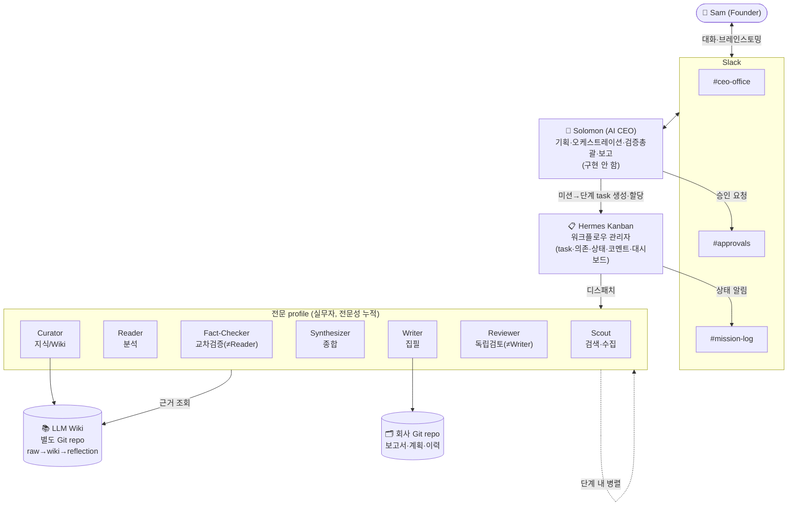
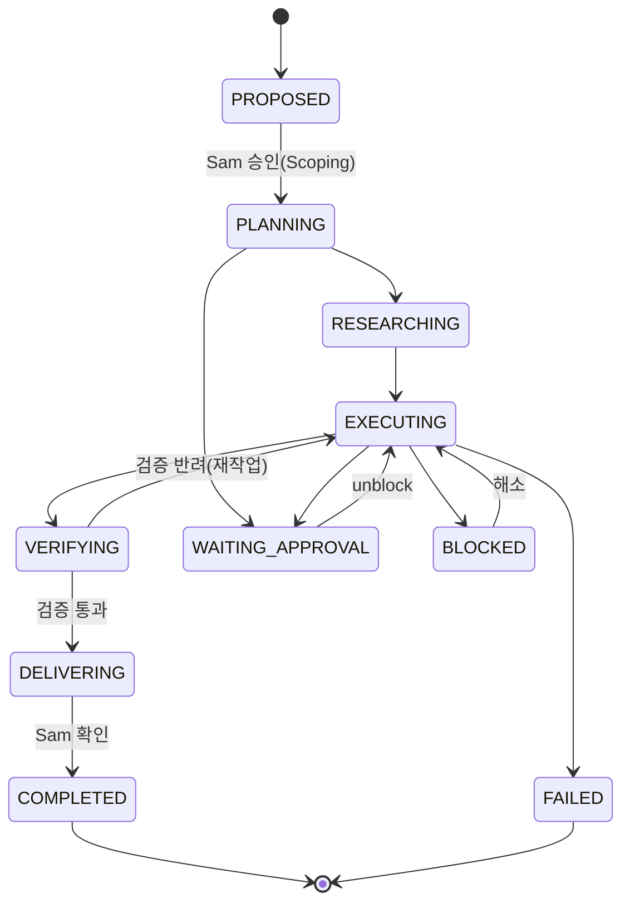
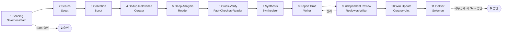
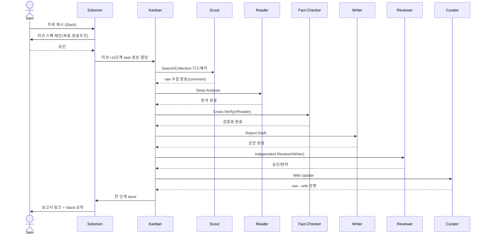
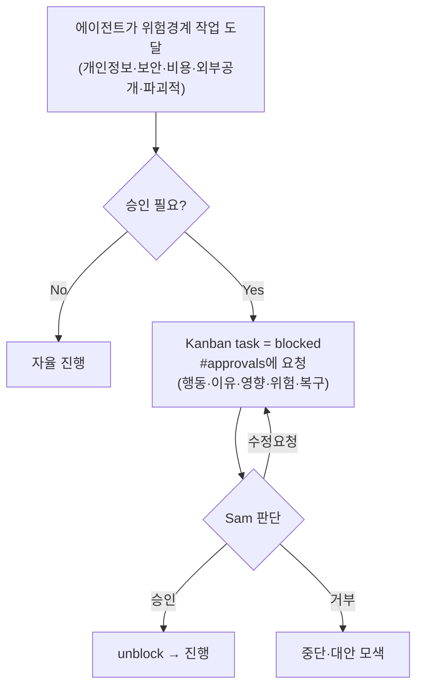
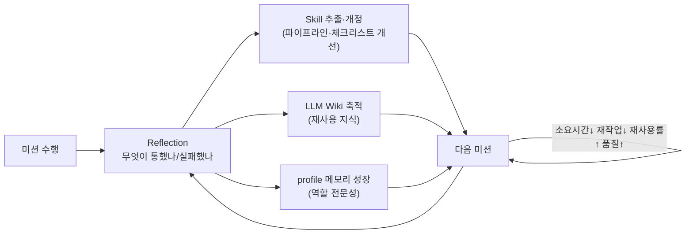
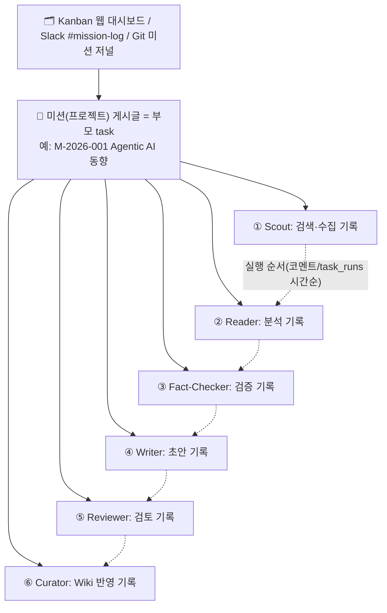
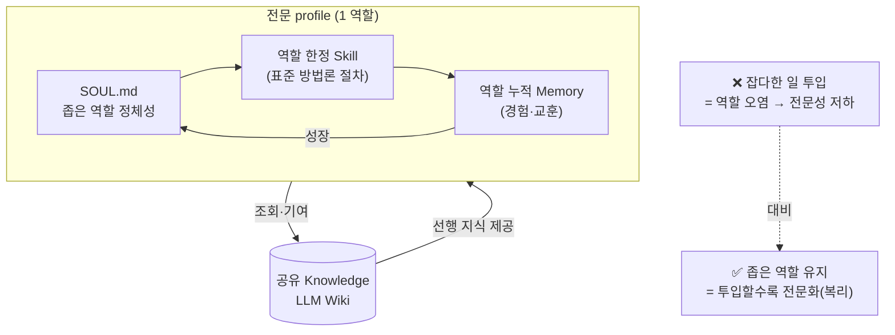

# 07. 설계 다이어그램 (Diagrams)

> 작성일: 2026-08-02 · 렌더: GitHub Mermaid (```mermaid 코드펜스)
> 관련: [`02`](./02_company_design.md) · [`03`](./03_mission_pipeline_and_workflow.md) · [`04`](./04_mvp_research_trend_report_spec.md) · [`08`](./08_agent_specialization_and_governance.md) · [`09`](./09_mission_board_and_visibility.md)

이 문서는 지금까지의 설계를 시각화한다. 각 다이어그램은 관련 설계 문서의 내용을 그림으로 옮긴 것이다.

---

## 1. 시스템 아키텍처 (Option B: Kanban + 전문 profile)



---

## 2. 미션 생명주기 상태 머신



---

## 3. 미션 A 파이프라인 (11노드) — `research-trend-report`



---

## 4. 파이프라인 노드 ↔ Kanban 매핑

```mermaid
flowchart TB
    subgraph Pipeline["워크플로우(파이프라인)"]
        P0["미션(프로젝트)"]
        PA["단계 A 산출물"]
        PB["단계 B 산출물(검증)"]
    end
    subgraph KanbanModel["Hermes Kanban"]
        K0["부모 task = 미션"]
        KA["자식 task A (assignee=profile)"]
        KB["자식 task B (parents=[A])"]
        KC["task_comment / task_runs\n= 에이전트 기록"]
        KE["task_events = 상태전이 감사"]
        KS["status: todo→ready→running→done\n/ blocked"]
    end

    P0 --> K0
    PA --> KA
    PB --> KB
    KA -->|의존(게이트)| KB
    KA --> KC
    KA --> KE
    KA --> KS
    KB --> KC
```

---

## 5. 에이전트 상호작용 시퀀스 (미션 A 축약)



---

## 6. 사람(Sam) 승인 게이트 흐름



---

## 7. 복리 성장 루프 (회사가 시간이 지날수록 좋아지는 이유)



---

## 8. 미션 게시판 계층 (Sam이 보는 진행 현황)



---

## 9. 전문화 스택 (에이전트-스킬-메모리-지식)


